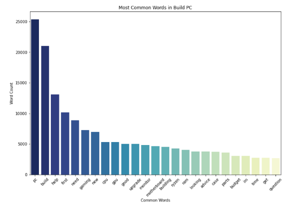
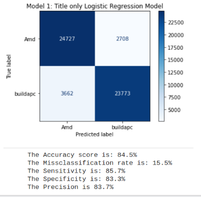
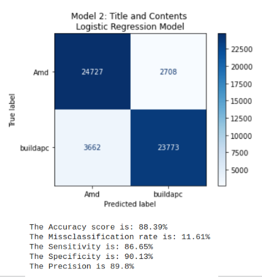
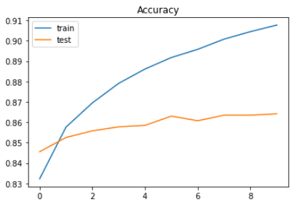
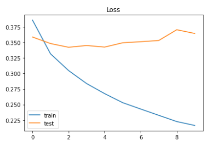
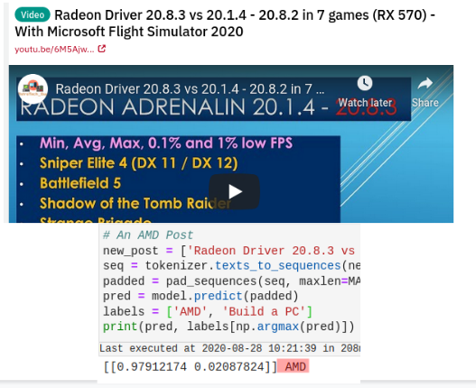

##  Intel: A Step in Reclaiming the PC Build Summit
David D Lee | DSIR-720 | 8-28-2020

## AMD and Build a PC Subreddit Predictor: Project Overview

- Created Logistic Regression, Naive Bayes, and Long Short-term Memory Recurrent Neural Network models that predicts the subreddit of a post based off of the words in the title, and the content of the post.
- Web Scraped both reddits pulling in over 100,000 posts each using Pushshift's API
- Cleaned and vectorized the word data with 25,000 unigram features and roughly 160,000 bigram title and content features using sklearn.
- Identified the words that are best associated with determining whether a post if for the AMD, of Build a Pc Subreddit.
- Created an LSTM RNN model that can predict the Subreddit between AMD and BuildaPC using only the title with an 86.5% accuracy.

## Problem Statement

#### How can we predict and market the computer parts consumers will buy, better than our competitors? (For Intel)
 
 

### Contents:
``` 
project_3-masterDL
|__ Data 
|   |__ amd_big.csv  
|   |__ build_pc_big.csv  
|   |__ tf_df.csv  
|__ images  
|   |__ AMD_test.png  
|   |__ build_pc_test.png  
|   |__ common_words_amd.png  
|   |__ common_words_build_pc.png  
|   |__ LSTM_Score.png   
|   |__ model1_title_logistic_regression.png  
|   |__ model2_title__and_contents_logistic_regression.png  
|   |__ model3a_title__and_contents_naive_bayes_gridsearch.png  
|   |__ model3b_title__and_contents_logistic_regression_gridsearch.png  
|   |__ rnn_loss.png  
|   |__ rnn_accuracy.png  
|   |__ rnn_loss2.png  
|   |__ rnn_accuracy2.png  
|__ 01_Web_Scaping_DL.ipynb (Web_Scraping)  
|__ 02_Model_Benchmark.ipynb (Benchmarks)  
|__ 03_Data_Cleaning_EDA_Models1&2.ipynb (EDA_and_model1&2)  
|__ 04_Models_3a_and_3b_Logistic_Regression_and_Multinomial_NB_Models.ipynb (model3a_and_3b)  
|__ 05_Model_4_LSTM_RNN_and_Conclusions.ipynb (lstm_nueral_net)  
|__ Intel_presentation.png
|__ README.md   
```

### Code and API
Python Version: 3.7
- [Packages: numpy, pandas, matplotlib, sklearn, regex, nltk, cufflinks, requests, time, seaborn, tensorflow, keras]
- [Datasets scraped using Pushshift's API(https://github.com/pushshift/api)]


## Web Scraping
Using pushshift's API, a function was created that would loop through each of the chosen subreddits scraping 25 posts with Title and Content each.  A count of 5,000 was set, which looped until it completed, or an error was returned.


## Data Cleaning
The scraped data had several numbers and special characters that would interfere with our modeling.  Using regex, and by reading a number of posts, a function was created in removing irrelevant information.  In the content of a post(selftext), there were several posts that were removed by reddit or the user which showed as this: [removed].  These were also removed.


## EDA
By parsing out the the most common words, we were able to see that there were specific words that are centered around each subreddit, finding words that were common and unique to each category. 

There is no surprise that the word Ryzen followed by AMD are nearly 4 times more common than other words in determining a post.  
Note that build and gaming are not unique to AMD’s reddit implying that pc builders and the gaming market are associated with both categories.

We also noticed how Intel, MSI, and versus are on the unique words list implying that consumers are comparing vendors helping or hurting our market sentiment.  


On our build a pc list, the words Pc and build are at the top of our list. Help is the 3rd most common word and it was 7th on the AMD list in the previous page.  Gaming is 6th most common word here and 8th for AMD.  

It seems like AMD’s subreddit has similarities on words associated with the build a pc community, and perhaps focus their marketing towards them.  

Looking at our unique words list , we see Advice,  budget, question, and time which also may be helpful in determining the market in the pc building community.

It is worth investigating to see how these words change in popularity over time. It's a strong basis for building a classification model around.



## Benchmark:
Before working on an optimal model, a baseline of 50% was established as the number of each subreddit are equal.

A baseline model was also created using Multinomial Naive Bayes on the Title and Contents of a Reddit post before cleaning of the data.  

The training set had an accuracy of 78.55%.
The training set had an accuracy of 78.25%.

These are the scores to beat.


## Model Building
Given the nature and complexity of language, the best approach for our modeling was to test multiple methods of Natural Language Processing to find an optimal solution.


The models used in this project were Logistic Regression, Multinomial Naive Bayes, a Grid Search on each, along with a LSTM RNN model.


  
Model 1: Logistic Regression Model for Title only Confusion Matrix   
ngram_range = (1,3)   
max features 25000     
min_df = 2   
 


  
Model 2: Logistic Regression Model with Title and Selftext Confusion Matrix   
ngram_range = (1,2)   
max features 25000     
min_df = 2   
 


  
Model 3a: Naive Bayes with Gridsearch with Title and Selftext Confusion Matrix    
Best Parameters:  
                {'cvec__max_features': 30000,  
                'cvec__ngram_range': (1, 1),  
                'cvec__stop_words': 'english'}  


  
Model 3b: Logistic Regression with Gridsearch with Title and Selftext Confusion Matrix      
Best Parameters:  
                {'cvec__max_features': 30000,  
                 'cvec__ngram_range': (1, 2),  
                 'cvec__stop_words': None}  


  
    
    
Model 4: Long Short-Term Memory Recurrent Neural Network on Title only       
Best Parameters:    
MAX WORDS = 50000  
MAX SEQUENCE LENGTH = 500  
EMBEDDING DIMENSIONS = 100  
Spatial Dropout = 0.2  
LSTM Layers = 100  
Dropout = 0.2  
Recurrent Dropout = 0.2  
Dense Layer = 2  
Activation = Softmax  
Loss = Categorical Cross Entropy  
Optimizer = adam  
Metrics = Accuracy  
epochs = 10  
batch_size = 64  

## Performance Results:
Our train and test data results by model are as follows:
- Model 1: Logistic Regression Model on Title
    train score: 0.8816839803171131
    test score: 0.8528704209950793  

- Model 2: Logistic Regression Model with Title and Selftext   
    train score: 0.9332604337525059
    test score: 0.8841443411700383  
    
- Model 3a: Naive Bayes with Gridsearch with Title and Selftext  
    train score: 0.8162140817690299
    test score: 0.8104793147439402 
   
- Model 3b: Logistic Regression with Gridsearch  
    train score: 0.9417289350586234
    test score: 0.8875341716785129 
 
- Model 4: Long Short-Term Memory Recurrent Neural Network Model (LSTM RNN) 
    training accuracy: 0.9417289350586234
    testing accuracy: 0.8875341716785129


## Conclusions:

An AMD Post
- https://www.reddit.com/r/Amd/comments/ii2mlv/radeon_driver_2083_vs_2014_2082_in_7_games_rx_570/  
  

A Build a PC Post
- https://www.reddit.com/r/buildapc/comments/ihuxwa/im_a_bit_overwhelmed_with_the_many_different/  
   
After successfully testing our model on predicting the Subreddits on unseen Reddit Titles correctly, we can determine that creating marketing and development strategies based on market sentiment is possible. By improving on the model, the possibilities of scraping several posts on various platforms on all computer manufacturers may  greatly benefit Intel on staying ahead of the technological curve, and regain dominance in the PC building market.


## Next Steps
With more time, creating a model that can routinely scrape more data on several computer parts manufacturers is ideal.  Being able to see how our model performs with several outcomes may provide insights on improving on our model.

At the present state, I would include the contents with the titles to determine the increase in accuracy compared to my best Logistic Regression model.  

After rigorous training, we would test the improved version of the model on social networks such as Facebook to see how well it can capture relevant data where a title tag is not present.

## Additional Resources:
Get Submission 
- https://pythonprogramming.altervista.org/collect-data-from-reddit/?doing_wp_cron=1597670992.0452320575714111328125

Loop Inspiration: 
- https://www.textjuicer.com/2019/07/crawling-all-submissions-from-a-subreddit/

Countdown for each iteration: 
- https://datatofish.com/while-loop-python/

Ignore error:
- https://stackoverflow.com/questions/38707513/ignoring-an-error-message-to-continue-with-the-loop-in-python    

Interpreting Coefficients:
- https://towardsdatascience.com/interpreting-coefficients-in-linear-and-logistic-regression-6ddf1295f6f1

Optimize memory:
- https://medium.com/@aakashgoel12/avoid-memory-error-techniques-to-reduce-dataframe-memory-usage-fcf53b2318a2

Regex Cleaning:
- https://stackoverflow.com/questions/30315035/strip-numbers-from-string-in-python

Keras Embedding:
- https://machinelearningmastery.com/use-word-embedding-layers-deep-learning-keras/
- https://stats.stackexchange.com/questions/270546/how-does-keras-embedding-layer-work

Keras Sequential Model:
- https://keras.io/guides/sequential_model/

Drop out:
- https://machinelearningmastery.com/dropout-for-regularizing-deep-neural-networks/
- https://machinelearningmastery.com/use-dropout-lstm-networks-time-series-forecasting/#:~:text=Long%20Short%2DTerm%20Memory%20

Softmax:
- https://medium.com/analytics-vidhya/softmax-classifier-using-tensorflow-on-mnist-dataset-with-sample-code-6538d0783b84
- https://medium.com/data-science-bootcamp/understand-the-softmax-function-in-minutes-f3a59641e86d

LSTM:
- https://towardsdatascience.com/choosing-the-right-hyperparameters-for-a-simple-lstm-using-keras-f8e9ed76f046
- https://towardsdatascience.com/multi-class-text-classification-with-lstm-1590bee1bd17 
- https://towardsdatascience.com/illustrated-guide-to-lstms-and-gru-s-a-step-by-step-explanation-44e9eb85bf21#:~:text=An%20LSTM%20has%20a%20similar,operations%20within%20the%20LSTM's%20cells.&text=These%20operations%20are%20used%20to,to%20keep%20or%20forget%20information. 

Accuracy / Loss Plots: 
- https://towardsdatascience.com/multi-class-text-classification-with-lstm-1590bee1bd17


#### Special thanks to Aiden Curley